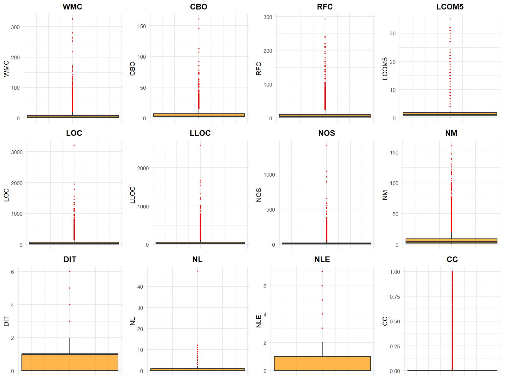
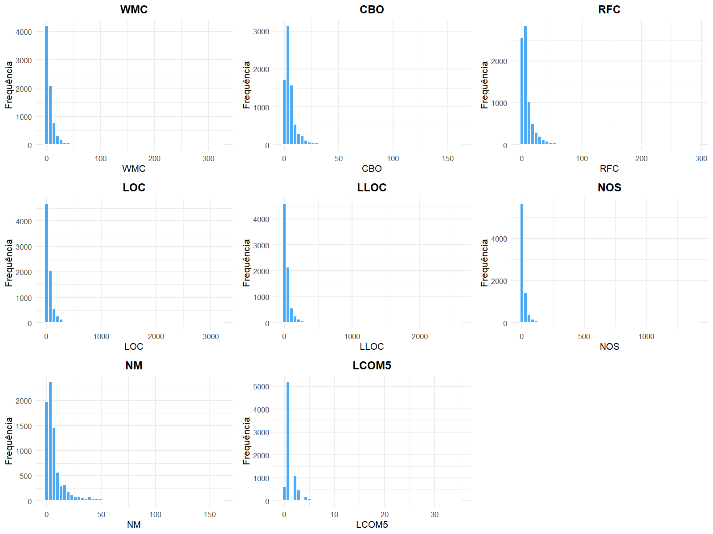
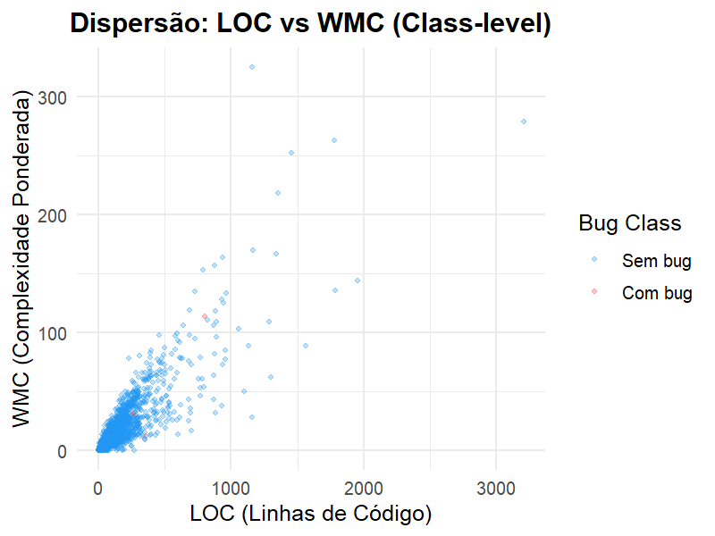
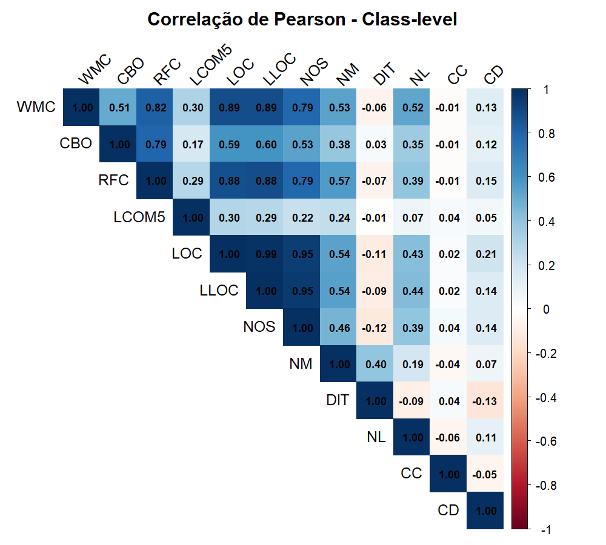
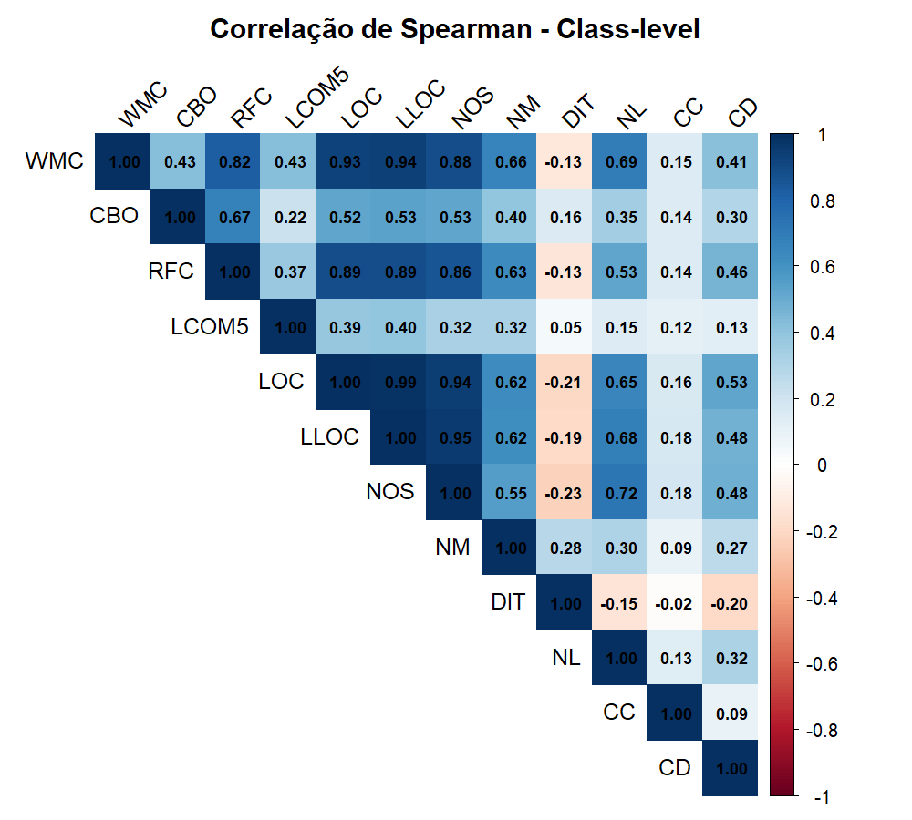
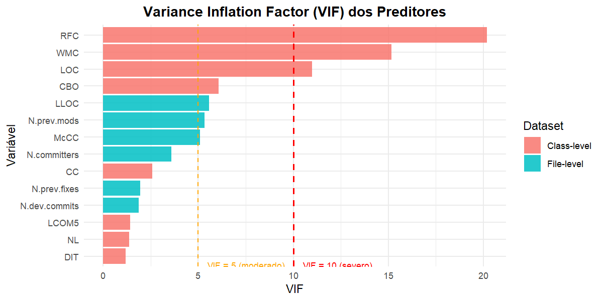
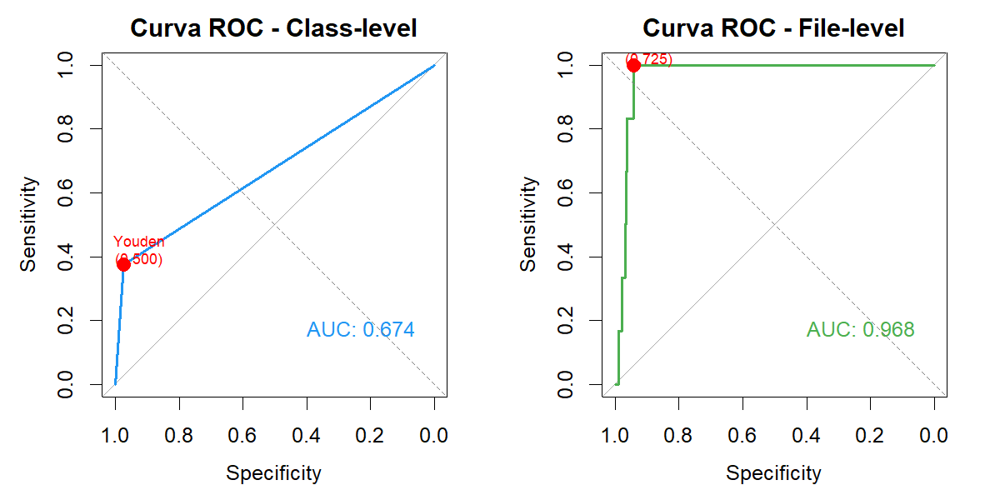

# Analise Estatistica de Metricas de Codigo-Fonte do Framework Neo4j

Apresentacao completa do artigo sobre qualidade de software, metricas orientadas a objetos e predicao de defeitos no framework **Neo4j**, a partir do **GitHub Bug Dataset v1.1**.

O objetivo central do trabalho nao e vender um classificador como bem-sucedido. O principal resultado e mais importante: o dataset do Neo4j, nesta versao, e **estatisticamente inadequado para predicao confiavel de defeitos**, devido ao desbalanceamento extremo da variavel-alvo.

> **Mensagem principal do artigo:** as metricas de codigo revelam padroes fortes de tamanho, complexidade, assimetria e multicolinearidade, mas a quantidade de classes/arquivos com bug e pequena demais para sustentar modelos preditivos confiaveis. A limitacao esta no dataset, nao nas metricas.

---

## Sumario

- [1. Identificacao do trabalho](#1-identificacao-do-trabalho)
- [2. Problema investigado](#2-problema-investigado)
- [3. Objeto de estudo: Neo4j](#3-objeto-de-estudo-neo4j)
- [4. Fonte dos dados](#4-fonte-dos-dados)
- [5. Glossario de siglas e metricas](#5-glossario-de-siglas-e-metricas)
- [6. Metodologia estatistica](#6-metodologia-estatistica)
- [7. Selecao de variaveis](#7-selecao-de-variaveis)
- [8. Resultados descritivos](#8-resultados-descritivos)
- [9. Normalidade, correlacao e multicolinearidade](#9-normalidade-correlacao-e-multicolinearidade)
- [10. Modelagem e validacao](#10-modelagem-e-validacao)
- [11. Discussao e interpretacao dos achados](#11-discussao-e-interpretacao-dos-achados)
- [12. Ameacas a validade](#12-ameacas-a-validade)
- [13. Conclusao do artigo](#13-conclusao-do-artigo)
- [14. Roteiro para apresentacao oral](#14-roteiro-para-apresentacao-oral)
- [15. Estrutura do repositorio](#15-estrutura-do-repositorio)
- [16. Como reproduzir](#16-como-reproduzir)
- [17. Dashboard Shiny](#17-dashboard-shiny)
- [18. Referencias centrais](#18-referencias-centrais)

---

## 1. Identificacao do trabalho

| Item | Informacao |
|---|---|
| Titulo | Analise Estatistica de Metricas de Codigo-Fonte do Framework Neo4j |
| Area | Engenharia de Software empirica |
| Tema | Metricas de software, qualidade de codigo e predicao de defeitos |
| Instituicao | IBMEC - Engenharia de Software |
| Dataset | GitHub Bug Dataset v1.1 |
| Projeto analisado | Neo4j |
| Linguagem do sistema analisado | Java |
| Versao do artigo mais recente | `IEEE_artigo/IEEE-conference-template-062824/artigo_neo4j_ieee_claude.tex` |
| Artigo SBC anterior | `artigo/main.tex` |
| Script principal | `scripts/analise_final.R` |
| Repositorio | <https://github.com/IgorMariano25/Projeto-ES-Neo4j> |
| Dashboard | <https://igormariano.shinyapps.io/Projeto-ES-Neo4j/> |

**Autor:** Igor Mariano Lopes Rodrigues

**E-mail institucional:** 202407095992@alunos.ibmec.edu.br

**Curso:** Engenharia de Software - IBMEC

**Local:** Rio de Janeiro, Brasil

**Palavras-chave:** software metrics, object-oriented design, statistical analysis, fault prediction, class imbalance, Neo4j.

---

## 2. Problema investigado

A Engenharia de Software utiliza metricas de codigo-fonte para estimar caracteristicas como:

- complexidade;
- acoplamento;
- coesao;
- tamanho;
- documentacao;
- presenca de codigo clonado;
- propensao a defeitos.

A literatura mostra que metricas orientadas a objetos, especialmente as da suite CK de Chidamber e Kemerer, podem se relacionar com falhas de software. No entanto, essa relacao depende fortemente da qualidade estatistica do dataset usado.

Este artigo investiga a seguinte questao:

> **As metricas de codigo-fonte do Neo4j, no GitHub Bug Dataset v1.1, permitem uma analise estatistica robusta e uma predicao confiavel de defeitos?**

A resposta encontrada e dupla:

1. **Sim**, as metricas permitem uma analise estatistica rica sobre tamanho, complexidade, assimetria, outliers, correlacao e multicolinearidade.
2. **Nao**, elas nao permitem uma predicao confiavel de defeitos neste dataset especifico, porque ha pouquissimos exemplos positivos de bug.

---

## 3. Objeto de estudo: Neo4j

O **Neo4j** e um sistema de banco de dados em grafo de codigo aberto, escrito predominantemente em Java, usado para modelar dominios altamente conectados, como redes sociais, recomendacao, deteccao de fraudes e grafos de conhecimento.

Ele foi escolhido como caso de estudo por tres motivos:

| Motivo | Relevancia |
|---|---|
| Projeto real e amplamente utilizado | A analise nao fica restrita a exemplos artificiais |
| Codigo Java orientado a objetos | Permite aplicar metricas CK e metricas estruturais |
| Presenca no GitHub Bug Dataset v1.1 | Fornece metricas e historico de bugs ja extraidos |

O Neo4j e, portanto, um bom objeto para estudar **estrutura de codigo**. A limitacao aparece quando se tenta estudar **predicao de bugs**, porque a variavel-alvo tem pouquissimos casos positivos.

---

## 4. Fonte dos dados

Os dados foram extraidos do **GitHub Bug Dataset v1.1**, base publica que associa metricas de codigo-fonte a registros historicos de defeitos. As metricas foram produzidas pela ferramenta de analise estatica **SourceMeter**.

Foram analisadas duas granularidades:

| Dataset | Arquivo | Instancias | Atributos originais | Granularidade |
|---|---:|---:|---:|---|
| Class-level | `dataset/neo4j-Class.csv` | 7.917 | 113 | Classe Java |
| File-level | `dataset/neo4j-File.csv` | 4.261 | 12 | Arquivo Java |

Nenhum dos dois datasets apresentou valores ausentes.

### Variavel-alvo

A variavel-alvo e **Number of bugs**, isto e, o numero de defeitos historicamente associados a uma classe ou arquivo. Para modelagem binaria, ela foi transformada em:

| Valor | Interpretacao |
|---:|---|
| 0 | Sem bug registrado |
| 1 | Com pelo menos um bug registrado |

### Distribuicao de bugs

| Granularidade | Instancias totais | Instancias com bug | Percentual positivo |
|---|---:|---:|---:|
| Class-level | 7.917 | 8 | 0,10% |
| File-level | 4.261 | 6 | 0,14% |

Esse e o ponto mais critico do artigo: a classe positiva e extremamente rara. A razao **EPV (Events Per Variable)** resultante e de aproximadamente **1**, muito abaixo do minimo recomendado de **10**.

---

## 5. Glossario de siglas e metricas

Para acompanhar a apresentacao, vale conhecer as siglas usadas no artigo. As metricas orientadas a objetos derivam majoritariamente da suite CK e de suas extensoes implementadas pela ferramenta SourceMeter.

### Metricas de codigo-fonte

| Categoria | Sigla | Significado |
|---|---|---|
| Complexidade e estrutura | WMC | Weighted Methods per Class (metodos ponderados por classe) |
| Complexidade e estrutura | McCC | McCabe's Cyclomatic Complexity (complexidade ciclomatica) |
| Complexidade e estrutura | NL | Nesting Level (nivel de aninhamento) |
| Complexidade e estrutura | NLE | Nesting Level Else-If (aninhamento sem clausulas else-if) |
| Acoplamento e resposta | CBO | Coupling Between Object classes (acoplamento entre objetos) |
| Acoplamento e resposta | RFC | Response For a Class (conjunto de resposta de uma classe) |
| Coesao | LCOM5 | Lack of Cohesion in Methods (falta de coesao, 5a versao) |
| Heranca | DIT | Depth of Inheritance Tree (profundidade da arvore de heranca) |
| Heranca | NOC | Number of Children (numero de classes-filhas) |
| Tamanho | LOC | Lines of Code (linhas de codigo) |
| Tamanho | LLOC | Logical Lines of Code (linhas logicas de codigo) |
| Tamanho | NOS | Number of Statements (numero de sentencas) |
| Tamanho | NM | Number of Methods (numero de metodos) |
| Tamanho | NA | Number of Attributes (numero de atributos) |
| Documentacao | CD | Comment Density (densidade de comentarios) |
| Documentacao | CLOC | Comment Lines of Code (linhas de comentario) |
| Clones | CC | Clone Coverage (cobertura de codigo clonado) |
| Qualidade | WarningInfo / WarningMajor | Alertas PMD agregados (severidade informativa e maior) |

### Siglas estatisticas e de avaliacao de modelos

| Sigla | Significado |
|---|---|
| IQR | Interquartile Range (amplitude interquartil) |
| VIF | Variance Inflation Factor (fator de inflacao da variancia) |
| EPV | Events Per Variable (eventos por variavel: positivos / preditores) |
| ROC | Receiver Operating Characteristic |
| AUC | Area Under the Curve (area sob a curva) |
| AUC-PR | Area sob a curva Precision-Recall (precisao-revocacao) |
| CV | Cross-Validation (validacao cruzada) |
| MCC | Matthews Correlation Coefficient |
| F1-score | Media harmonica entre precisao e revocacao |
| Bal. Acc. | Balanced Accuracy (acuracia balanceada) |
| Q1, Q2, Q3 | Primeiro, segundo (mediana) e terceiro quartis |
| Pk | k-esimo percentil |

---

## 6. Metodologia estatistica

O pipeline do artigo foi estruturado para ir de uma exploracao descritiva ate uma avaliacao preditiva com validacao cruzada.

```text
Datasets CSV
    -> limpeza e selecao de variaveis
    -> estatistica descritiva (tendencia central, dispersao, posicao)
    -> visualizacoes (histogramas, boxplots, dispersao, heatmaps)
    -> deteccao de outliers (metodo IQR)
    -> testes de normalidade (Shapiro-Wilk e Lilliefors)
    -> correlacao Pearson/Spearman
    -> multicolinearidade por VIF
    -> regressao logistica cost-sensitive
    -> validacao cruzada estratificada 10-fold
    -> interpretacao critica dos resultados
```

### Tecnicas aplicadas

| Etapa | Tecnicas |
|---|---|
| Tendencia central | Media, mediana e moda |
| Dispersao | Amplitude, variancia, desvio padrao e coeficiente de variacao |
| Posicao relativa | Quartis, percentis, IQR |
| Visualizacao | Histogramas, boxplots, dispersao, densidade, heatmaps |
| Outliers | Metodo IQR |
| Normalidade | Shapiro-Wilk e Lilliefors |
| Associacao | Correlacao de Pearson e Spearman |
| Multicolinearidade | VIF - Variance Inflation Factor |
| Modelagem | Regressao logistica binaria cost-sensitive |
| Validacao | 10-fold cross-validation estratificada |
| Limiar de classificacao | Youden Index |
| Avaliacao | AUC-ROC, AUC-PR, sensibilidade, precisao, F1, Balanced Accuracy e MCC |

---

## 7. Selecao de variaveis

A selecao de variaveis aplicou tres criterios objetivos sobre os 113 atributos Class-level e os 12 atributos File-level.

### 7.1 Natureza metrica

Foram mantidas apenas variaveis com significado quantitativo sobre o codigo-fonte. Foram removidos identificadores e metadados posicionais, como:

```text
ID, Name, LongName, Parent, Component, Path,
Line, Column, EndLine, EndColumn
```

Essas colunas identificam elementos do codigo, mas nao medem qualidade, complexidade ou defeitos.

### 7.2 Variabilidade nao nula

Variaveis constantes ou praticamente constantes foram removidas, pois nao contribuem para:

- correlacoes;
- testes de hipotese;
- regressao;
- calculo de VIF.

No dataset File-level, esse criterio removeu **CLOC**, pois todas as 4.261 instancias possuem valor zero nessa coluna.

### 7.3 Nao redundancia

No Class-level, foram removidas variaveis redundantes:

- metricas com prefixo `T`, que representam totais agregados a classes aninhadas e apresentavam correlacao acima de 0,99 com suas contrapartes;
- variantes locais com prefixo `NL`;
- proxies de acoplamento ja capturados por CBO/RFC, como CBOI, NII e NOI;
- as 37 categorias granulares de regras PMD, colapsadas em `WarningInfo` e `WarningMajor`.

### Variaveis finais

No **Class-level**, restaram **19 variaveis numericas**:

| Categoria | Variaveis |
|---|---|
| Complexidade | WMC, NL, NLE |
| Acoplamento | CBO, RFC |
| Coesao | LCOM5 |
| Heranca | DIT, NOC |
| Tamanho | LOC, LLOC, NOS, NM, NA |
| Clones | CC |
| Documentacao | CD, CLOC |
| Qualidade | WarningInfo, WarningMajor |
| Alvo | Number of bugs |

No **File-level**, restaram **7 variaveis**:

```text
McCC,
LLOC,
Number of previous modifications,
Number of previous fixes,
Number of committers,
Number of developer commits,
Number of bugs
```

---

## 8. Resultados descritivos

### 8.1 Tendencia central

As metricas de tamanho e complexidade apresentaram assimetria positiva: a media ficou consistentemente acima da mediana.

| Metrica | Media | Mediana | Moda | Interpretacao |
|---|---:|---:|---:|---|
| WMC | 7,39 | 3,00 | 1 | Muitas classes simples e poucas muito complexas |
| CBO | 5,64 | 3,00 | 2 | Acoplamento concentrado em valores baixos |
| RFC | 9,84 | 5,00 | 1 | Resposta da classe com cauda longa |
| LCOM5 | 1,58 | 1,00 | 1 | Coesao geralmente alta na maioria das classes |
| LOC | 59,70 | 25,00 | 7 | Tamanho altamente assimetrico |
| LLOC | 49,18 | 21,00 | 8 | Mesmo padrao de LOC |
| NOS | 18,77 | 5,00 | 1 | Poucas classes concentram muitos comandos |
| NM | 8,61 | 4,00 | 1 | Muitas classes com poucos metodos |
| DIT | 0,98 | 1,00 | 1 | Heranca rasa no Neo4j |
| CC | 0,12 | 0,00 | 0 | Maioria sem cobertura de clones |

No File-level, o mesmo padrao aparece:

| Metrica | Media | Mediana | Leitura |
|---|---:|---:|---|
| McCC | 6,06 | 2,00 | Complexidade ciclomatica concentrada em valores baixos |
| LLOC | 102,74 | 55,00 | Arquivos grandes existem, mas nao representam a maioria |

A relacao `media > mediana > moda` e o marcador classico de assimetria positiva.

### 8.2 Dispersao

| Metrica | Amplitude | Variancia | Desvio padrao |
|---|---:|---:|---:|
| WMC | 325 | 193,25 | 13,90 |
| CBO | 161 | 55,57 | 7,45 |
| RFC | 293 | 256,19 | 16,01 |
| LCOM5 | 71 | 12,33 | 3,51 |
| LOC | 3.207 | 13.360,81 | 115,59 |
| LLOC | 2.588 | 8.473,03 | 92,05 |
| NOS | 1.411 | 2.218,10 | 47,10 |
| NM | 161 | 183,94 | 13,56 |
| DIT | 6 | 0,99 | 0,99 |
| CC | 1 | 0,08 | 0,29 |

Destaques:

- **LOC** tem desvio padrao de 115,59, quase o dobro de sua media, e **coeficiente de variacao de 1,94**, o maior entre as metricas de tamanho. Isso confirma alta heterogeneidade no tamanho das classes.
- **DIT** tem variancia de apenas 0,99, tornando essa metrica praticamente irrelevante como discriminador de fault-proneness no Neo4j.
- No File-level, **Number of developer commits** apresenta variancia de 4.106.050,59 e desvio padrao de 2.026,34, decorrente da grande discrepancia entre desenvolvedores.

### 8.3 Posicao relativa (quartis e percentis)

| Metrica | Q1 | Q2 (mediana) | Q3 | IQR | Percentil de cauda |
|---|---:|---:|---:|---:|---:|
| WMC (Class) | 1 | 3 | 8 | 7 | P95 = 27 |
| LOC (Class) | 7 | 25 | 60 | 53 | - |
| McCC (File) | 1 | 2 | 6 | 5 | P90 = 18 |
| LLOC (File) | 20 | 55 | 112 | 92 | - |

Para WMC, 75% das classes possuem valor menor ou igual a 8, enquanto o maximo observado e 325 — uma cauda extremamente longa.

### 8.4 Boxplots e outliers



Os boxplots mostram forte presenca de outliers superiores. Eles **nao foram removidos**, pois representam classes legitimamente complexas do framework.

| Metrica | Outliers | Percentual | Limite superior |
|---|---:|---:|---:|
| WMC | 706 | 8,92% | 18,50 |
| CBO | 644 | 8,13% | 14,50 |
| RFC | 759 | 9,59% | 24,50 |
| LOC | 799 | 10,09% | 140,00 |
| LLOC | 787 | 9,94% | 112,50 |
| NOS | 840 | 10,61% | 42,00 |
| NM | 866 | 10,94% | 19,50 |
| CC | 1.780 | 22,48% | 0,00 |

A proporcao de outliers varia entre **5,86% (NA)** e **22,48% (CC)**. Para as metricas de tamanho (LOC, LLOC, NOS), cerca de 10% sao outliers, consistente com a regra de Pareto em software: uma minoria de componentes concentra a maior complexidade. O caso de **CC** chama atencao: como a maioria dos valores e zero, qualquer valor positivo passa a ser tratado como outlier pelo metodo IQR.

### 8.5 Histogramas



Os histogramas mostram distribuicoes:

- concentradas em valores baixos;
- assimetricas a direita;
- com caudas longas;
- incompativeis com normalidade.

Essa forma (pico em zero, decaimento aproximadamente exponencial e cauda pesada) e compativel com distribuicoes log-normal ou de lei de potencia, padrao comum em metricas de software: muitas classes pequenas e simples, poucas classes grandes e complexas.

### 8.6 Relacao entre tamanho e complexidade



A dispersao entre **LOC** e **WMC** mostra relacao positiva forte: classes maiores tendem a ter maior complexidade ponderada.

As poucas instancias com bug aparecem em regioes de valores moderados a altos, mas o numero de positivos (8 classes) e pequeno demais para sustentar uma conclusao causal ou preditiva robusta.

---

## 9. Normalidade, correlacao e multicolinearidade

### 9.1 Normalidade

Todos os testes rejeitaram a hipotese de normalidade, com `p < 10^-50` para todas as variaveis.

| Variavel | Shapiro-Wilk W | p-valor SW | Lilliefors D | p-valor Lilliefors |
|---|---:|---:|---:|---:|
| WMC | 0,4214 | < 10^-83 | 0,3081 | < 2,2 x 10^-16 |
| CBO | 0,5874 | < 10^-76 | 0,2246 | < 2,2 x 10^-16 |
| RFC | 0,5158 | < 10^-79 | 0,2786 | < 2,2 x 10^-16 |
| LOC | 0,4244 | < 10^-83 | 0,3113 | < 2,2 x 10^-16 |
| DIT | 0,8267 | < 10^-59 | 0,2520 | < 2,2 x 10^-16 |
| CC | 0,4754 | < 10^-81 | 0,4410 | < 2,2 x 10^-16 |

A estatistica de Shapiro-Wilk variou entre 0,013 (Number of bugs) e 0,827 (DIT), sempre muito distante de 1. O teste foi aplicado em amostra de 5.000 observacoes com `seed=42`, respeitando o limite da implementacao em R.

O **Lilliefors** foi usado porque o Kolmogorov-Smirnov classico fica excessivamente conservador quando a media e o desvio padrao sao estimados pela propria amostra. O Lilliefors recalcula os valores criticos para esse caso. A convergencia dos dois testes elimina qualquer duvida sobre a violacao de normalidade.

### 9.2 Correlacao



Correlacoes **fortes** (`|r| >= 0,7`) no Class-level:

| Relacao | Pearson |
|---|---:|
| LOC x LLOC | 0,99 |
| LOC x NOS | 0,95 |
| WMC x LOC | 0,89 |
| WMC x RFC | 0,82 |
| CBO x RFC | 0,80 |

Correlacoes **moderadas** (`0,4 <= |r| < 0,7`): WMC x CBO = 0,51; WMC x NM = 0,53; CBO x LOC = 0,59.

As correlacoes de Spearman, mais robustas para dados assimetricos e com outliers, seguem o mesmo padrao com magnitudes geralmente mais elevadas (ex.: LOC x LLOC `rho = 0,99`; NOS x NL `rho = 0,72`).



No File-level, as correlacoes de destaque foram:

| Relacao | Valor |
|---|---:|
| McCC x LLOC | Pearson = 0,72 |
| Previous modifications x committers | Pearson = 0,77 |
| Previous modifications x committers | Spearman = 0,90 |

### 9.3 Multicolinearidade (VIF)



O VIF indicou multicolinearidade severa no Class-level (VIF > 10):

| Variavel | VIF antes da remocao |
|---|---:|
| RFC | 20,18 |
| WMC | 15,17 |
| LOC | 10,98 |

RFC foi removida iterativamente do modelo Class-level, justificada pela redundancia com WMC (`r = 0,82`) e CBO (`r = 0,80`). Depois disso, os VIF finais ficaram abaixo de 10:

| Variavel | VIF final |
|---|---:|
| WMC | 8,75 |
| LOC | 9,16 |
| Demais | <= 5 |

No File-level, todos os VIF ficaram abaixo ou iguais a 5,58.

---

## 10. Modelagem e validacao

### 10.1 Regressao logistica cost-sensitive

Foi usada regressao logistica binaria com pesos inversamente proporcionais a frequencia das classes:

```text
w+ = N / (2 * N+)
w- = N / (2 * N-)
```

Essa estrategia tenta reduzir o efeito do desbalanceamento, evitando que o modelo simplesmente classifique tudo como "sem bug".

#### Modelo Class-level

Preditores apos tratamento de VIF:

```text
WMC, CBO, LOC, LCOM5, NL, DIT, CC
```

Resultado critico:

- o algoritmo **nao convergiu**;
- os coeficientes ficaram em magnitude extrema (ordem 10^12 a 10^15);
- houve indicio de **separacao completa** dos dados;
- o EPV ficou aproximadamente igual a 1;
- o Pseudo R2 de McFadden foi **-10,76** (valores entre 0,2 e 0,4 indicariam ajuste excelente).

#### Modelo File-level

Preditores:

```text
McCC,
LLOC,
Number of previous modifications,
Number of previous fixes,
Number of committers,
Number of developer commits
```

Resultado:

- Pseudo R2 de McFadden = 0,59;
- o algoritmo tambem nao convergiu;
- apenas LLOC nao foi significativo (p = 0,30);
- os resultados nao devem ser interpretados como confiaveis, pois ha apenas 6 arquivos com bug.

### 10.2 Validacao cruzada e metricas

A validacao cruzada foi estratificada em 10 folds, com threshold definido pelo **Youden Index** (`J = Sensibilidade + Especificidade - 1`).



| Metrica | Class treino | File treino | Class 10-fold CV | File 10-fold CV |
|---|---:|---:|---:|---:|
| AUC-ROC | 0,674 | 0,968 | 0,660 | 0,805 |
| AUC-PR | 0,007 | 0,020 | - | - |
| Sensibilidade | 0,375 | 1,000 | 0,625 | 0,833 |
| Precisao | 0,014 | 0,024 | 0,002 | 0,007 |
| F1-score | 0,027 | 0,047 | 0,004 | 0,014 |
| Balanced Accuracy | 0,674 | 0,972 | 0,664 | 0,836 |
| MCC | 0,069 | 0,151 | 0,023 | 0,068 |

A degradacao na validacao cruzada confirma overfitting, especialmente no File-level (AUC 0,97 -> 0,81). O **MCC** e a metrica mais reveladora: valores proximos de zero (0,023 e 0,068 no CV) indicam que o classificador praticamente nao possui poder preditivo real. As curvas Precision-Recall (AUC-PR de 0,007 e 0,020) confirmam a inadequacao dos dados.

### Por que a acuracia engana?

Com apenas 0,10% a 0,14% de instancias positivas, um classificador trivial que sempre prediz "sem bug" ja alcanca aproximadamente 99% de acuracia. Por isso, a acuracia alta nao significa que o modelo aprendeu a identificar defeitos.

Neste estudo, as metricas mais importantes para interpretar o modelo sao:

| Metrica | Por que importa |
|---|---|
| MCC | Penaliza desequilibrios e mostra associacao real entre predicao e classe |
| AUC-PR | Mais informativa quando a classe positiva e rara |
| Precisao | Mostra quantos alertas positivos realmente eram bugs |
| F1-score | Resume precisao e sensibilidade |
| Validacao cruzada | Reduz otimismo do treino completo |

---

## 11. Discussao e interpretacao dos achados

### Achado 1: metricas de software sao assimetricas

Todas as principais metricas seguem distribuicoes assimetricas a direita. A maioria das classes e pequena/simples, enquanto poucas concentram grande parte da complexidade.

### Achado 2: tamanho e complexidade se sobrepoem

LOC, LLOC, NOS, WMC e RFC apresentaram correlacoes fortes. Isso indica que varias metricas capturam dimensoes parecidas do codigo, confirmado pela analise VIF.

### Achado 3: a arquitetura do Neo4j parece ter heranca rasa

DIT e NOC tiveram variancia quase nula. Isso sugere uma arquitetura mais "flat", na qual hierarquias profundas de heranca nao sao dominantes.

### Achado 4: a correlacao entre metricas e bugs e quase nula

A correlacao maxima observada entre qualquer metrica e a variavel-alvo foi de apenas **r = 0,06**. Isso contrasta com estudos anteriores (Basili et al.; Gyimothy et al.) e e explicado pelo desbalanceamento extremo e pelo provavel subreporte de defeitos.

### Achado 5: o problema nao esta nas metricas

WMC e CBO sao apontadas como dos melhores preditores na literatura, mas tambem nao apresentaram poder preditivo aqui. Isso reforca que a limitacao e do **dataset**, e nao das metricas. Com 8 classes e 6 arquivos positivos, a amostra nao tem potencia estatistica suficiente para sustentar predicao de defeitos.

---

## 12. Ameacas a validade

### Validade interna

- O desbalanceamento extremo (8 classes e 6 arquivos com bug; EPV ~ 1) causa separacao completa e nao convergencia da regressao.
- O K-S com parametros estimados seria conservador — corrigido com Lilliefors.
- A multicolinearidade severa (LOC x LLOC `r = 0,99`) foi corrigida via remocao iterativa de variaveis com VIF > 10.
- A avaliacao no proprio conjunto de treino foi corrigida com 10-fold CV estratificada.
- O Shapiro-Wilk usa amostra de 5.000 observacoes, mitigada pela reproducibilidade com `seed=42` e pela convergencia com Lilliefors.

### Validade externa

- O estudo analisa apenas o Neo4j, em uma unica versao.
- Os resultados podem nao se generalizar para outros projetos Java.
- O dominio (banco de dados em grafo) tem arquitetura plana; a baixa variabilidade de DIT e NOC e provavelmente idiossincrasia.
- Ha vies de captura do GitHub Bug Dataset: apenas defeitos vinculados a commits de correcao sao registrados.

### Validade de construto

- Metricas CK sao proxies estruturais imperfeitos, nao medidas diretas de qualidade percebida.
- `Number of bugs` representa bugs historicamente registrados e ligados a commits, nao todos os defeitos existentes.
- LCOM5 possui multiplas formulacoes.
- A agregacao de regras PMD em `WarningInfo` e `WarningMajor` reduz a granularidade semantica.

### Validade de conclusao

- Ha baixissimo poder estatistico para inferencias sobre a variavel-alvo.
- Cerca de 170 correlacoes pareadas foram calculadas sem correcao formal para comparacoes multiplas; as associacoes fortes (`|r| >= 0,7`) coincidem em Pearson e Spearman.
- Os p-valores muito pequenos nos testes de normalidade refletem tambem a sensibilidade dos testes a `n` grande.
- As convencoes internas da ferramenta SourceMeter influenciam todas as metricas de forma sistematica.

---

## 13. Conclusao do artigo

O estudo confirma que o Neo4j possui padroes estatisticos tipicos de sistemas de software reais:

- distribuicoes assimetricas e nao normais (todos os `p < 10^-50`);
- caudas longas e muitos outliers superiores (entre 5% e 22%);
- forte relacao entre tamanho e complexidade (LOC x LLOC `r = 0,99`);
- multicolinearidade entre metricas estruturais.

No entanto, a predicao de defeitos **nao e confiavel** neste dataset.

O principal achado e:

> **O GitHub Bug Dataset v1.1 para o Neo4j, na granularidade analisada, nao possui eventos positivos suficientes para sustentar modelos confiaveis de predicao de defeitos.**

Com EPV aproximadamente igual a 1, modelos logisticos ficam instaveis, nao convergem e apresentam MCC proximo de zero em validacao cruzada (0,023 e 0,068).

### Trabalhos futuros

1. Combinar multiplas versoes do Neo4j para aumentar os positivos e viabilizar EPV >= 10.
2. Investigar outros projetos do GitHub Bug Dataset para comparacao.
3. Aplicar tecnicas como Random Forest e gradient boosting, que tratam desbalanceamento nativamente.
4. Explorar predicao cross-project.
5. Avaliar alternativas para rotulagem de defeitos, reduzindo subnotificacao.

---

## 14. Roteiro para apresentacao oral

Esta secao organiza o README como uma apresentacao do artigo.

### Slide 1 - Titulo

**Analise Estatistica de Metricas de Codigo-Fonte do Framework Neo4j**

Diga que o trabalho combina Engenharia de Software empirica, estatistica e predicao de defeitos.

### Slide 2 - Motivacao

Metricas de codigo sao usadas para estimar qualidade e risco, mas modelos preditivos dependem da qualidade do dataset.

### Slide 3 - Problema de pesquisa

> As metricas do Neo4j permitem predizer defeitos de forma confiavel?

### Slide 4 - Dataset

| Nivel | Instancias | Atributos |
|---|---:|---:|
| Classe | 7.917 | 113 |
| Arquivo | 4.261 | 12 |

Antecipe o ponto critico: apenas 8 classes e 6 arquivos com bug (EPV ~ 1).

### Slide 5 - Metodologia

```text
Descritiva -> Outliers -> Normalidade -> Correlacao -> VIF -> Regressao -> CV
```

### Slide 6 - Selecao de variaveis

Tres criterios: remover identificadores, remover variaveis constantes, remover redundancias. Restaram 19 variaveis Class-level e 7 File-level.

### Slide 7 - Distribuicoes

Use os histogramas: media maior que mediana, caudas longas, nao normalidade, padrao comum em software.

### Slide 8 - Outliers

Use os boxplots e destaque que outliers nao sao erros. Eles representam classes reais e complexas (entre 5% e 22% por metrica).

### Slide 9 - Correlacoes

| Relacao | r |
|---|---:|
| LOC x LLOC | 0,99 |
| LOC x NOS | 0,95 |
| WMC x LOC | 0,89 |
| WMC x RFC | 0,82 |

Explique que tamanho e complexidade se misturam.

### Slide 10 - VIF

Multicolinearidade: RFC = 20,18; WMC = 15,17; LOC = 10,98. RFC foi removida para estabilizar o modelo.

### Slide 11 - Modelo

Apresente a regressao logistica cost-sensitive e o motivo: lidar com o desbalanceamento.

### Slide 12 - Resultado da validacao

| Nivel | MCC CV |
|---|---:|
| Classe | 0,023 |
| Arquivo | 0,068 |

MCC proximo de zero = poder preditivo praticamente nulo.

### Slide 13 - Por que a acuracia engana

Com quase todo mundo "sem bug", prever sempre "sem bug" ja gera ~99% de acuracia.

### Slide 14 - Conclusao

> O dataset e inadequado para predicao de defeitos, nao necessariamente as metricas.

Reforce: a correlacao maxima metrica x bug foi de apenas r = 0,06.

### Slide 15 - Trabalhos futuros

Mais versoes, mais projetos e tecnicas adequadas para eventos raros.

---

## 15. Estrutura do repositorio

```text
Projeto-ES-Neo4j/
├── README.md
├── CLAUDE.md
├── api_r/
│   ├── api.R
│   ├── apiR.md
│   └── rsconnect/
├── artigo/
│   ├── main.tex
│   ├── sbc-template.bib
│   └── sbc-template.sty
├── dataset/
│   ├── neo4j-Class.csv
│   ├── neo4j-Class.csv.arff
│   ├── neo4j-File.csv
│   └── neo4j-File.csv.arff
├── figuras/
│   ├── boxplots_class.png
│   ├── boxplots_file.png
│   ├── histogramas_class.png
│   ├── histogramas_file.png
│   ├── dispersao_loc_wmc.png
│   ├── correlacao_heatmap_class.png
│   ├── correlacao_spearman_class.png
│   ├── vif_barplot.png
│   ├── curva_roc.png
│   └── demais figuras da analise
├── IEEE_artigo/
│   └── IEEE-conference-template-062824/
│       ├── artigo_neo4j_ieee.tex
│       ├── artigo_neo4j_ieee_claude.tex   (versao mais recente)
│       ├── IEEEtran.cls
│       └── IEEEtran_HOWTO.pdf
├── PDFsRefencia/
├── MaterialR/
└── scripts/
    ├── analise_final.R
    └── exploracao_inicial.py
```

---

## 16. Como reproduzir

### 16.1 Pre-requisitos

Instale o R e os pacotes usados na analise:

```r
install.packages(c(
  "ggplot2",
  "dplyr",
  "tidyr",
  "corrplot",
  "PerformanceAnalytics",
  "gridExtra",
  "scales",
  "car",
  "nortest",
  "pROC",
  "caret",
  "PRROC"
))
```

### 16.2 Executar exploracao inicial

O script Python usa caminhos relativos a partir da pasta `scripts/`.

```powershell
cd scripts
python exploracao_inicial.py
```

### 16.3 Executar analise estatistica completa

Execute a partir da raiz do projeto:

```powershell
Rscript scripts/analise_final.R
```

Esse comando regenera os graficos em `figuras/`.

### 16.4 Compilar artigo IEEE (versao mais recente)

```powershell
cd IEEE_artigo/IEEE-conference-template-062824
pdflatex artigo_neo4j_ieee_claude.tex
pdflatex artigo_neo4j_ieee_claude.tex
```

### 16.5 Compilar artigo SBC (versao anterior)

```powershell
cd artigo
pdflatex main.tex
bibtex main
pdflatex main.tex
pdflatex main.tex
```

---

## 17. Dashboard Shiny

A aplicacao web complementar esta publicada em:

<https://igormariano.shinyapps.io/Projeto-ES-Neo4j/>

Ela permite explorar visualmente parte dos dados, testar previsoes e navegar pelas metricas do dataset.

Arquivos principais:

| Arquivo | Funcao |
|---|---|
| `api_r/api.R` | Aplicacao Shiny |
| `api_r/apiR.md` | Documentacao do dashboard |

### Observacao importante

O dashboard e uma ferramenta demonstrativa e exploratoria. As previsoes de bug devem ser lidas como referencia relativa, nao como diagnostico confiavel. Essa cautela e coerente com a conclusao do artigo: o dataset e fortemente desbalanceado.

---

## 18. Referencias centrais

As referencias completas estao no artigo. As principais bases teoricas incluem:

| Referencia | Contribuicao |
|---|---|
| Pressman e Maxim | Fundamentos de Engenharia de Software |
| Chidamber e Kemerer | Suite CK de metricas orientadas a objetos |
| Basili, Briand e Melo | Validacao de metricas OO como indicadores de qualidade |
| Gyimothy, Ferenc e Siket | Validacao empirica de metricas OO para predicao de falhas |
| Toth, Gyimesi e Ferenc | GitHub Bug Dataset |
| Radjenovic et al. | Revisao sistematica sobre metricas de predicao de falhas |
| Nagappan, Ball e Zeller | Mineracao de metricas para predizer falhas de componentes |
| Montgomery e Runger | Estatistica aplicada e VIF |
| Shapiro e Wilk | Teste de normalidade Shapiro-Wilk |
| Lilliefors | Correcao do teste K-S com parametros estimados |
| McFadden | Pseudo R2 para modelos logisticos |
| Hosmer, Lemeshow e Sturdivant | Regressao logistica e regra de EPV |

---

## Sintese final

Este projeto mostra que metricas de codigo-fonte sao extremamente uteis para compreender a estrutura do Neo4j, mas que predizer defeitos exige mais do que metricas: exige uma variavel-alvo com quantidade suficiente de eventos positivos.

Neste caso, o dataset permite uma boa analise estatistica de qualidade de codigo, mas nao permite uma predicao de bugs estatisticamente confiavel. A correlacao maxima entre qualquer metrica e a ocorrencia de bugs foi de apenas r = 0,06 — uma demonstracao direta de que o limite esta nos dados, e nao nas metricas.
